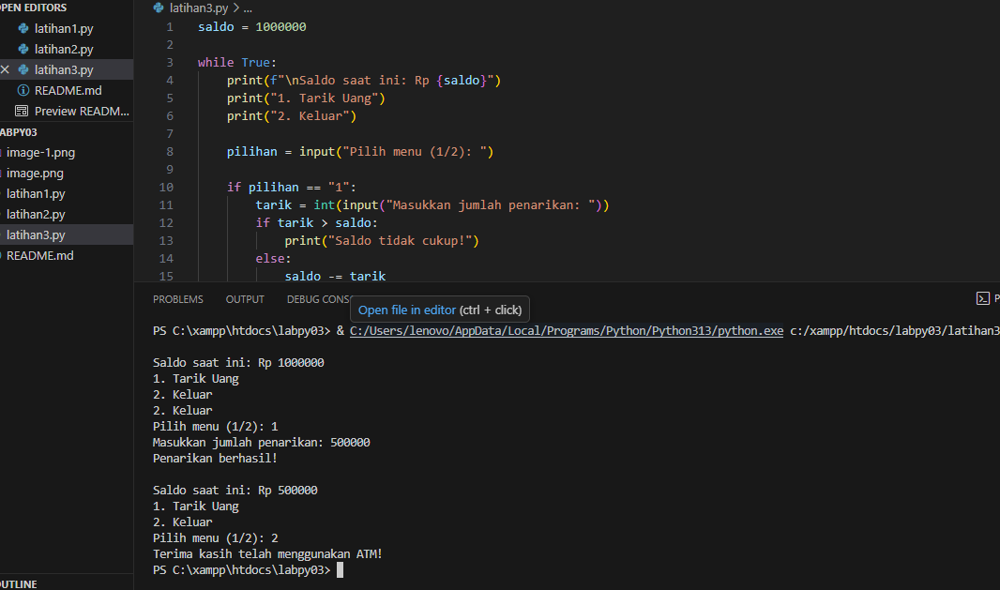

# Penjelasan File Alur Algoritma Latihan 1-3
## 1. Latihan1.py
### Tampilan Bilangan acak
<strong>Deskripsi</strong>

 Menmpilakan bilangan bikangan acak yang lebih kecil dari 0.5 sesuai sesuai jumlalh data (n) yang dimasukan

<strong>B. Alur Algoritma</strong>
<pre>
<b>Mulai</b>

<li>Program diawali dengan mengimpor fungsi random() dari pustaka random.</li>

<b>Input Data
</b>
<li>Pengguna diminta untuk memasukkan sebuah bilangan bulat N yang menunjukkan berapa banyak bilangan acak yang ingin ditampilkan.</li>

<b>Inisialisasi Variabel</b>
<li>Variabel penghitung [i] diinisialisasi dengan nilai 1.
<li>Variabel ini digunakan untuk menghitung berapa banyak data acak yang telah ditampilkan.</li>

<b>Proses Perulangan</b>
<li>menjalankan perulangan while i <= N.
<li>Di dalam perulangan, fungsi random() dipanggil untuk menghasilkan angka acak a antara 0.0 dan 1.0.</li>

<b>Kondisi</b>
<li>Setiap nilai a yang dihasilkan akan diperiksa:
<li>Jika a < 0.5, maka angka tersebut ditampilkan ke layar sebagai “data ke-i”.
<li>Setelah ditampilkan, variabel i akan ditambah satu (i += 1).
<li>Jika a ≥ 0.5, maka angka tersebut tidak ditampilkan, dan perulangan berlanjut tanpa menambah nilai i.
</li>
<b>Selesai</b>
<li>Setelah jumlah data yang valid (< 0.5) mencapai N, perulangan berhenti.
<li>Program menampilkan pesan “Selesai” sebagai tanda bahwa proses telah berakhir.</li></pre>

### Gambar Screenshot
## 

## 2. Latihan2.py
### Menghitung Laba Selama 8 Bulan
<strong>A. Diskripsi</strong>

menghitung total laba usaha selama 8 bulan berdasarkan ketentuan pertumbuhan laba yang berbeda setiap bulan, Pengusaha memulai usaha dengan modal awal Rp 100.000.000, dan laba setiap bulan dihitung berdasarkan persentase tertentu dari modal awal.

<pre><strong>B. Alur Algoritma</strong>
<b>Mulai Program</b>
<li>Program dimulai dengan menetapkan modal awal sebesar Rp 100.000.000.
<b>Inisialisasi Variabel</b>
<li>modal digunakan untuk menyimpan modal awal.
<li>total_laba diset menjadi 0 untuk menghitung total laba keseluruhan.</li>
<b>Perulangan Bulanan</b>
<li>menggunakan perulangan for dari bulan ke-1 sampai bulan ke-8.</li>
<li>Setiap bulan, laba dihitung berdasarkan aturan berikut:</li>

 a. Bulan 1–2: Belum ada laba (laba = 0)

 b. Bulan 3–4: Laba 1% dari modal (laba = modal * 0.01)

 c. Bulan 5–7: Laba 5% dari modal (laba = modal * 0.05)

 d. Bulan 8: Laba turun menjadi 3% dari modal (laba = modal * 0.03)

<b>Menampilkan Laba Tiap Bulan</b>
<li>Setelah laba dihitung, program menampilkan hasil laba setiap bulan ke layar.</li>
<b>Menjumlahkan Total Laba</b>
<li>Nilai laba setiap bulan ditambahkan ke variabel total_laba.</li>
<b>Menampilkan Total Laba Akhir</b>
<li>Setelah perulangan selesai, program menampilkan total laba selama 8 bulan.</li>
<b>Selesai</b>
<li>Program berakhir setelah menampilkan hasil total laba.</li></pre>

### Gambar Screnshoot
## 

## 3. Latihan3.py
### Simulasi ATM Sederhana
<strong>Deskripsi</strong>

mensimulasikan mesin ATM sederhana menggunakan bahasa pemrograman Python, Pengguna memiliki saldo awal sebesar Rp 1.000.000, dan dapat melakukan penarikan uang hingga saldo habis atau memilih untuk keluar dari program.
   
Program ini memanfaatkan struktur perulangan while untuk menjalankan menu ATM secara terus-menerus sampai pengguna memilih opsi keluar.

<pre><strong>Tampilan Program</strong>

<strong>A.</strong> Menampilkan saldo awal pengguna

<strong>B.</strong> Menyediakan menu pilihan:

<li>(1) Tarik Uang
<li>(2) Keluar</li>

<strong>C.</strong>Jika pengguna memilih Tarik Uang:
<li>Program akan meminta pengguna memasukkan jumlah uang yang ingin ditarik.
Jika jumlah yang dimasukkan tidak melebihi saldo, maka saldo akan dikurangi dan penarikan dianggap berhasil.
Jika saldo tidak mencukupi, program akan menampilkan pesan kesalahan.</li>

<strong>D.</strong> Jika pengguna memilih Keluar, program akan berhenti dan menampilkan pesan “Terima kasih telah menggunakan ATM.

<b>Alur Argoritma</b>

<b>1.</b>  Mulai

<b>2.</b>  Inisialisasi saldo awal sebesar Rp 1.000.000.

<b>3.</b>  Selama pengguna belum memilih keluar (while True):
<li>Tampilkan saldo saat ini.
<li>Tampilkan menu pilihan (1 dan 2).
<li>Minta input pilihan pengguna.</li>

<b>4.</b>  Jika pilihan = 1 (Tarik Uang):
<li>Minta input jumlah penarikan.
<li>Jika jumlah ≤ saldo, kurangi saldo dan tampilkan pesan “Penarikan berhasil!”.
<li>Jika jumlah > saldo, tampilkan pesan “Saldo tidak cukup".<li>

<b>5.</b>  Jika pilihan = 2 (Keluar):
<li>Tampilkan pesan “Terima kasih telah menggunakan ATM!”.
<li>Hentikan program (break).</li>

<b>6.</b>  Selesai.</pre>

### Gambar Scerenshoot
## 
